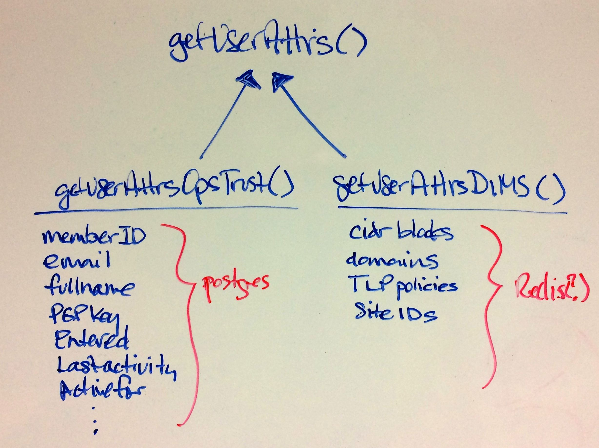

.. _challenges:

Challenges Encountered
======================

This section describes many of the challenges that were encountered
during the project's period of performance. Some where eventually overcome
in the final months of the project, though others were not. Suggestions
on dealing with some of these issues are found in Section :ref:`enhancements`
and Section :ref:`recommendations`.

.. _toolknowledge:

Understanding the Tools Being Used
----------------------------------

It is a myth that humans only use 10% of their brain. [1]_ But it is
common for programmers and system administrators to only learn a
small portion of the features and capabilities of any given program
or tool that they may need to use. The simple thing to do is go search
`StackExchange`_ for system administration tasks, or `StackOverflow`_
for programming tasks, and simply copy/paste what someone posts there
in order to quickly "solve" the problem at hand and move on to the
next thing.

Taking such short-cuts, trying to avoid the investment of time required to
learn the capabilities of a given tool can result in problems later on.
Scripts may be written that restrict or limit the utility of the underlying
programs they call, or that perform extra work that could be done in a more
straight-forward or idiomatic way using advanced features of the underlying
programs. At the very minimum, everyone sharing use of a common tool must have
a sufficient baseline familiarization with the content of available
documentation by skimming through it completely to be able to quickly get past
a blocker.

When someone is tasked with solving a particular problem, given a set of
requirements or use cases that should be satisfied, it is important that they
take responsibility for studying the tool(s) being used to understand how best
to perform the task at hand and to share their knowledge with other team
members using the same tool. It does not work for the project lead to have to
become the expert in every tool and micro-manage how team members do their
work.

This problem was exacerbated in the DIMS Project due to the large number of new
and rapidly changing tools and technologies that are necessary to assemble a
system with the complexity defined in the project scope of work. Certain
project team members had experience in specific programming languages, limiting
their ability to contribute in some situations. Most had some familiarity with
Unix system administration on their own development workstations, but were not
able to branch out to unfamiliar Linux distributions.  During this project
every team member was pushed to learn new programming languages, new data
storage mechanisms, new inter-process communication protocols, new software
development tools and processes, new types of security event data, and new
concepts in network and host forensics required to process security event data,
threat intelligence streams, and malware artifact metadata.

.. _staffingchallenges:

Staffing Challenges
-------------------

The document :ref:`dimsjds:dimsjobdescriptions` was produced to list the full
set of skills and experience required by those working on a project of this
nature. As mentioned in the previous section, every member of the team was
pushed beyond their technical limits and had to constantly research and learn
new technologies and rapidly acquire new software engineering, network
engineering, or system administration skills.  Not everyone is capable of, or
happy with, being pushed beyond their limits on a daily basis and some turnover
within the project was directly related to this pressure to deliver.

Over the course of the project, the team size was typically 3-5 people, with
most of the team working at less than 100% FTE. One contractor was 100% FTE
for the majority of the project and had to step in to perform tasks that were
not being performed by other team members.

The team was also partially virtual, with one, two, and sometimes three
staff members working on the East Coast, while the rest of the team was
on the West Coast (mostly in Seattle, WA, but at one point split between
Seattle, Tacoma, and Bremerton, WA and one person in California.) Regular
"scrum" meetings were held using online tools (at various times Adobe Connect,
Skype, and Google Hangout were all used, to varying degrees of effectiveness or
frustration.) This made the problem of trying to bring team members up to speed
on new concepts and skills difficult, due to lack of physical presence and
availability.

Another difficulty resulted from political issues as opposed to strictly
technical issues. In order to meet the objectives of the contract, the team was
being pushed far beyond their capabilities. Some people respond to this by
putting in the extra time it takes to improve their skill set (either inside
working hours, or seeing it as an investment in their professional career,
doing some extra-curricular learning.) Others respond by pushing back, focusing
their efforts on only those tasks they are comfortable with and no more, or
otherwise not following the established development path. Some documentation
was not produced as requested (in some cases the PI was able to make up for
the deficit, but this was not possible when the PI did not write the software.)

One risk to a project that is hard to avoid is a dependency on external
software products or standards that are outside of the control of the project
(e.g., see :ref:`stix_dev_libraries`). Such situations can surface larger
organizational weaknesses and personnel issues that simply cannot be solved
without commitment and full-throated support from higher up in the
organization. The best that can sometimes be achieved is to learn from
the situation, find a way to move on, and carry the lessons forward
to do better in the future.

.. _dnschallenges:

DNS Challenges
--------------

Naming Computers
~~~~~~~~~~~~~~~~

Naming computers is not easy. One of the tenets of secure design is
*separation of services*, which historically has driven system
administrators to limit services to one service per computer. You have a DNS
server that does DNS, a database server for data storage, a web server
that provides HTTP/HTTPS web application services for browsers, an FTP file
server that only serves static files, etc.

In such simple deployments, naming a computer based on the service it
provides seems to make sense and to be simple. Until you decide to it
makes more sense to combine some related services on that one
computer, at which point one of two things happens:

#. The computer's name now only matches one of the two services, and
   it becomes harder to know what computer name to use when trying to
   connect to the second service. ("The Git repos are on ``git``, and
   Jira is on ``jira``. We put Jenkins on one of those two servers,
   but was it on ``git`` or on ``jira``?).

#. The service is put on another computer (possibly a virtual machine)
   and the computer's name now matches the service. But now there is also
   another computer host to manage, with ``iptables`` rules, accounts and
   passwords allowing administrator access, the need to copy in SSH keys, etc.
   As more computers are added, management and use gets harder and harder.

Part of this problem is handled by adopting a policy of *not* naming computers after
services, but instead using more generic host names (like colors like
``red`` and ``orange``, or generic names like ``node01`` through ``node09``).
Those host names are then mapped with DNS *A* records (and associated *PTR* records
to properly reverse-map the IP to name) and using CNAME entries that
create aliases in DNS name space, allowing URLs to be formed with the
service name as part of the DNS name. (E.g., ``trident.devops.local``
may map to ``yellow.devops.local`` via a CNAME).

The drawback to this is that the administration of A records, PTR records, and
CNAMES is more difficult than simple ``/etc/hosts`` entries, and requires a
deeper understanding of DNS internals by all involved. The final implementation
of DIMS Ansible playbooks generates DNS host name mappings using Jinja
templating to generalize creating DNS entries.

Another problem that must be dealt with when placing multiple services on
the same system is TCP port mappings. You can only have one service listening
to port ``80/tcp``, port ``443/tcp``, etc. That requires that services like
Trident, a web application service, etc., all have their own unique high-numbered
service ports (e.g., ``8080/tcp`` for Trident, ``8000/tcp`` for the web
application service, ``8500/tcp`` for Consul's UI, etc.) But now how do
you remember which port to use to get to which service on which host?
Adopting a prefix with the service's name and using a CNAME that aliases
the host allows an easier to remember mechanism to reach services,
though at the cost of complexity in NGINX reverse proxy configuration.
You can now access Trident using ``https://trident.devops.local/trident``
and ``https://consul.devops.local/consul`` to get to the Consul UI.
What is more, using multiple DNS records for each Consul node in
a cluster allows for round-robin access to distribute the connections
across cluster nodes:

.. code-block:: none

   $ dig consul.devops.local +short
   192.168.56.23
   192.168.56.21
   192.168.56.22

..

Separating DNS Name Spaces
~~~~~~~~~~~~~~~~~~~~~~~~~~

Adding to the complexity of DNS and host naming is the situation of multi-homed
hosts. Most people are used to one computer with one or two interfaces (like a
laptop with either a wired Ethernet interface, or a WiFi interface, only one of
which is active at any given time). That means the computer always has just one
active IP address, and since laptops are usually used for connecting as a
client to remote services, don't even need to have a DNS name!

Layered, segmented networks that involve external firewalling, Virtual Private
Network (VPN) access to multi-segmented Virtual Local Area Network (VLAN)
switched or virtual machine network environments cause problems when it comes
to host naming and DNS naming.

The early implementation of DIMS DNS used a single DNS namespace, with multiple
names per host that were arbitrarily chosen with some hosts having four or more
names using A records, some in the ``prisem.washington.edu`` namespace, even
though they only existed in the internal DNS server and not in the external
authoritative name servers.

For example, a DNS name like ``jira.prisem.washington.edu`` would exist in the
internal server, mapping to an IP address in the ``140.142.29.0/14`` network
block. Doing ``dig @128.95.120.1 jira.prisem.washington.edu`` (an official UW
name server) or ``dig @8.8.8.8 jira.prisem.washington.edu`` (one of Google's
name servers) would fail to get an IP address, but making the request of
the internal server would work. Since Jira was running behind a reverse
proxy, however, the host that was actually running the Jira server was
not the one using the address on the ``140.142.29.0/24`` network block, so
a second DNS name ``jira-int.prisem.washington.edu`` (also non-existent
externally) would map to the internal IP address, which was only accessible
over a VPN. This resulted in a huge amount of confusion. Which host was
actually running Jira? What port? What order for DNS servers has to exist
to ensure the request goes to the internal DNS server first, not the
external DNS servers that don't know the answer?

The proper way that multi-homed network namespace management is handled is through the
use of *Split horizon* (or *split-brain*) DNS.  This requires multiple DNS
servers, multiple DNS zones, and careful mapping of the IP addresses and DNS
names for each of the zones, as necessary to route packets properly through the
correct interface. Again, this requires a much deeper understanding of DNS than
is common.

Handling Dynamic Addressing on Mobile Devices
~~~~~~~~~~~~~~~~~~~~~~~~~~~~~~~~~~~~~~~~~~~~~

Yet one more issue that complicates connectivity is the use of mobile devices
like laptops, which must use a VPN to connect to access-controlled hosts behind
firewalls.  If split-horizon DNS is used, with one DNS server behind the VPN
such that it is only accessible when the VPN is connected, the mobile device
may experience significant delays in DNS requests that cannot be sent to the
unavailable DNS server. This requires complicated dynamic DNS resolver
configuration that is difficult to set up and to debug without expertise in
advanced network configuration on the operating system being used (in this
case, Mac OS X and Ubuntu Linux were the two predominant operating systems on
laptops.)

One of the ramifications of mobile devices using Ubuntu Linux is the role of
``NetworkManager``, a notoriously problematic service in terms of network
configuration management. It is very difficult to take control of services like
``dnsmasq`` for split-horizon DNS, or use VPNs (especially multiple VPNs, as
was implemented in this project from the start), without running into conflicts
with ``NetworkManager``.

The DIMS project started using the Consul service as a means of registering the
IP address of a client using a VPN, such that the current address and
accessibility status is available using Consul's DNS service. As Consul was
going to be used for service health monitoring as well, this seemed like a good
choice. One downside is further complexity in DNS handling, however, since not
all hosts in the deployment were configured to run Consul using Ansible
playbooks.

.. _distributedchallenges:

Distributed Systems Challenges
------------------------------

There are several challenges to building even a small-scale distributed
system compromising multiple operating systems on multiple network
segments with multiple layers of baremetal, virtual machine, and/or
containerization.

.. _physicalDistribution:

Physical Distribution
~~~~~~~~~~~~~~~~~~~~~

One of the core challenges when building distributed systems results from using
separate DNS host names and physically separate data centers and/or logically
separated subnets.

At the start of the DIMS project, hardware was physically located in two server
rooms in two separate buildings operated by the Applied Physics Laboratory,
with staff being located on a separate floor in one of the buildings. What
is more, some staff had computers using static IP addresses with direct
access to the internet, while others used dynamic IP addresses behind
a separate APL "logical firewall" device. This meant use of four separate
IP address ranges on four subnets behind two different firewalls. Other
hardware was located in the main UW Data Center in the UW Tower building
on a fifth network. Add to this one hypervisor on a system in the APL
server room and another in the UW Tower, each with a separate OpenVPN
server, with the necessity to route traffic between virtual machines
on the two hypervisors. (Both hypervisors, by the way, were different
and ran on two different operating systems.)

On multiple occasions, hardware had to be moved from one location
to another (which meant changing IP addresses on both bare-metal
hosts and virtual machines, changing routes, and changing VPNs.)
The last time hardware was moved, this time to consolidate it all
into one data center, the entire system became unstable and non-functional.

One of the machines being moved served as the hypervisor for approximately
a dozen virtual machines making up the core of the DIMS development
environment. At least three previous attempts were made to task team members
with documenting the "as-built" configuration of all of these components,
their IP addresses and routes, and mechanisms for remote control,
in order to plan for the configuration changes needed to perform the move.
Each previous time a move had been planned it had to be
put off because higher priority tasks needed to be addressed and/or team
members had left the project before they had completed the tasks necessary for
migration. When the hardware finally had to be hastily moved due to the
impending extended leave of a key participant, the hastily performed move
caused the entire DIMS network to become non-functional and the PI and two team
members spent the next five days working to get the system functional and
stable again.  This process revealed that the configuration of the DIMS systems
was significantly below the quality level previously assumed.  System
configuration settings were not adequately documented, were almost entirely
hand-crafted (as opposed to being under Ansible configuration control as was
specified), used two different hypervisors (KVM and Virtualbox) on two
different operating systems (RedHat Enterprise Linux 6 and Debian) and the
networking relied heavily on something known as `Project 172 private address
routing`_ combined with internal virtual networks that were administered by
just one former team member using remote desktop services and/or X11 forwarding
from a workstation that was no longer available as an option to use. The
instability and outages caused by this long-delayed (yet required) hardware
move set the team back significantly and had ripple effects on other deadlines
and events that could not be adjusted or canceled.

.. _stability:

Stability
~~~~~~~~~

Due to the inherent inter-relationships between subcomponents in a distributed
system, stability of the overall system is a constant challenge.  Not only are
relocations of hardware like those described in an earlier Section a contributor to
instability, but so are software changes.  As the DIMS project is using open
source operating systems and tools that may be updated on as frequent as a
monthly basis, often resulting in parts of the system "breaking" when an update
happens.

As the entire distributed system was not put under Ansible control from the
start, and "as-built" documentation was lacking in several areas, some
architectural changes resulted in critical system components breaking,
with no clear way
to fix them. This could lead to days of running ``tcpdump`` and ``strace``,
watching ``syslog`` log file output, and poking at servers (after clearing the
browser cache frequently to eliminate problems due to erroneous cached content)
in order to diagnose the problem, reverse engineer the solution, and
meticulously put all of the related configuration files under Ansible control.
This was complicated by the fact that the team members who set up some of these
systems were no longer on the project and could not assist in the cleanup.

One of the solutions that was attempted was to use Docker containers for
internal microservices. The hope was to avoid some of the complexities of
out-of-date libraries, version incompatibilities in programs, and differences
in operating systems. The project team looked at several ways to deploy Docker
containers in a clusterized environment and chose to use CoreOS (now called
"Container Linux by CoreOS"). While this allowed clusterization using ``etcd``,
``consul``, and eventually Docker Swarm mode, it also resulted in a trade-off
between leaving the three servers running CoreOS for clustering stable (and
thus drifting apart in versions from the regularly updated development hosts
running Ubuntu 14 and Debian 8), or dealing with changes to configuration files
that had to be ported to Vagrant Virtualbox "box" files and the bare-metal
cluster at the same time.  As these systems were not easily controlled with
Ansible at first, this caused a lot of pain that was never fully eliminated. As
the baremetal servers were re-purposed for pilot deployment work, the central
cluster services degraded and took some formerly working services with them.

.. _swengchallenges:

Software Engineering Challenges
-------------------------------

The software engineering skill levels and experience of the team members varied
widely, as did their individual coding styles, language preferences, and
debugging abilities. This resulted in several points of friction (both
technically and politically) over time. It also made it difficult to rely on
documented requirements and white board sessions to provide sufficient
direction for programmers to independently produce "production" quality system
components. A project of this scope requires more direct interaction between
the PI (who knows the user requirements and what needs to be built to meet
them) and individual team members (who are tasked with building those
components). This requires a greater level of institutional support
and commitment, or a more highly-skilled and experienced engineering
team, than was available.

.. _usingagile:

Using Agile
~~~~~~~~~~~

Exacerbated by the issues of team member physical distribution, timezone
differences, and work schedule differences was achieving and maintaining
a cadence with Agile/Scrum and software releases. All team members were new
to using Git, which has a steep learning curve to begin with. Differences
in versions across workstations caused problems in sharing code using Git.
Getting everyone to adopt common processes and tools proved to be difficult.
The most prevalent model for branching, described by Vincent Driessen's
"`A successful Git branching model`_" was chosen as the right model to follow.
Getting all team members to learn it, and follow it, was not entirely achieved.
(A diagram of the model is shown in Figure :ref:`vincentdriessenbranching`).

The :ref:`dimsdevguide:dimsdevguide` was produced, with sections laying out
things like policy (:ref:`dimsdevguide:policy`) and guidance on using Git
(:ref:`dimsdevguide:sourcemanagement`).

.. _vincentdriessenbranching:

.. figure:: images/git-model@2x.png
   :alt: Vincent Driessen Git branching model
   :width: 50%
   :align: center

   Vincent Driessen Git branching model

..

What tended to happen over and over was a situation where a large number of
disruptive changes and bugfixes would all be placed onto a single long-lived
feature branch (sometimes going for weeks at a time) before merging them back
into the ``develop`` branch, let alone released to the ``master`` branch.  In
order to test successfully (and sometimes just be be able to have a stable
build at all) would require multiple repositories all being on the same feature
branch. The worst case was that one part of the system would only work on one
feature branch and another part would only work on a different feature branch,
creating an impasse where a full build of multiple VMs would not work.  This
caused repeated states of instability and high stress leading up to
demonstrations.

It wasn't until Q2 2017 that stability was achieved on the ``master`` branch,
regular merges from feature branches to ``develop`` and vice-versa kept both
``develop`` and feature branches stable, and hotfix branches used more
diligently to improve ``master`` and ``develop`` branches without losing these
fixes on long-lived feature branches. In retrospect, "release early, release
often" and "build from master" to validate merged features should be the
mantra. (This process was adopted leading up to the pilot deployment, which was
built almost exclusively from the public ``master`` branch of
https://github.com/uw-dims/ansible-dims-playbooks).

.. _abstractionchallenges:

Challenges Related to Abstraction
~~~~~~~~~~~~~~~~~~~~~~~~~~~~~~~~~

Related to the :ref:`distributedchallenges` are challenges related
to abstraction. Abstraction presents challenges in many ways.

#. The presence of an abstraction layer in code and service connections
   may create opacity (i.e., things behave like a *black box* and either work
   or fail, with little feedback). This requires greater expertise in
   debugging.

#. Abstraction in service oriented architecture requires a greater level of
   expertise in configuring and debugging systems in that it is necessary
   for someone to be able to understand and control the system at any
   level in the abstracted stack, or to be able to jump up and down
   the application stack in order to diagnose and debug the system
   when something does not work. If someone is only capable of understanding
   the highest layer in the abstracted stack and something does not work,
   they must rely on someone else who has expertise at the lower layers
   in order to debug and fix any problems. (This is related to the
   issue of *opacity* in the system, or the *black box* effect).

#. The lack of an abstraction layer requires more direct connections between
   *caller* and *callee* in programs, or between *connector* and *connectee* in
   TCP/IP socket connections. This directness seems simple at first, but in the
   face of a large number of connections or calls, it becomes very difficult to
   add each new connection, to make changes, or to debug when one of a large
   number of similar looking connections fails.

#. The lack of an abstraction layer also makes it harder to support
   versioning of APIs, since more direct calls are being made
   and things like changes in function names or changes in
   IP addresses, DNS names, or TCP/IP ports.

One place where abstraction comes in handy is providing a standard application
programming interface (API) that takes a simple set of parameters in a function
call, but hides the underlying details of where data is obtained prior to being
returned to the caller in a single data structure. The Trident portal holds a
limited set of attributes about a user, but some programs integrated into DIMS
need more attributes. That means one of two things must happen:

#. Trident must be modified to support the extra attributes that are needed, or

#. An abstraction layer is added that allows one call to Trident to
   get the attributes it holds, and a second call to a DIMS database
   component to get the extra attributes, combining them into one
   data structure that is returned to the caller.  This is illustrated in
   Figure :ref:`figUserAttributes`.

.. _figUserAttributes:

   user-attributes.jpg

..

.. _backward_compatibility:

Backward Compatibility
~~~~~~~~~~~~~~~~~~~~~~

In Section :ref:`stability`, the problem of version drift between like
components in a distributed system was discussed. The right answer is to put
everything under Ansible control from the very start and to handle subtle
variations in how things are installed and configured by using the minimum
necessary "glue scripting" so as to stay in sync with versions across all
subsystems. This is a difficult task that takes expertise that was not commonly
available across all team members.

Backward compatibility issues also arose with one of the core components the
DIMS project was using: the Trident portal. Open source projects (DIMS
included) move forward and change things at whatever cadence they can follow.
Sometimes this means some fairly significant changes will happen quickly,
requiring some effort to keep up. This results in a challenge: stay on the
cutting edge by focusing effort as soon as changes are made, or try to maintain
some stability by pinning to older versions that are working?

In order to keep stability in the development environment to make forward
progress on a number of fronts, the Trident version was pinned to ``1.3.8``.
The pilot deployment, however, would need to be done using a newer version (at
the time ``1.4.2``, currently ``1.4.5``).  There were at least two significant
changes make between the ``1.3.8`` and ``1.4.2`` versions: The CSS style
sheets used by the Trident portal GUI went from two files to one file, changing
names at the same time, and there were some incompatible changes to the command
set for the ``tcli`` command line interface that was used by Ansible to install
and configure Trident.  These changes required some reverse engineering of the
changes by extracting files from the two packages and differencing everything
in order to then use conditional logic and dictionaries to quickly switch
between version ``1.3.8`` and ``1.4.2`` in order to keep a stable working
demo and simultaneously prepare for the pilot deployment. (A variation of
this technique is illustrated in the code block in the code block :ref:`clientpy`).
This diverted a significant amount of energy for a period of time that pushed
other tasks to the background.

.. _external_dependencies:

External Dependencies and Pacing
--------------------------------

One of the most laudable goals of this project was the use of open source tools
to be integrated into an affordable distributed system capable of scaling to
the degree needed to handle millions of security events per day. The flip side
of this is that every one of the open source tools that come from outside
entities are produced on someone else's whim (including pace of release,
quality of testing, rate of disruptive changes in code, time available to
respond to interactions, etc.)

For example, keeping up with the pace and direction of change in STIX core
development, and difficulties in maintaining development momentum within the
project team, limited this avenue and it could not be sustained. (See
:ref:`stix_dev_libraries`.) Other challenges listed in this section caused the
pace internal to our team to be much slower than desired, resulting in
difficulty in our reaching out and interacting with developers of the Trident
portal. The friction within the project slowed some of our internal
development, requiring that we play "catch-up" late in the project and not
being able to provide as much input as we had hoped to their developers towards
features we needed.

.. _testingchallenges:

Testing
-------

The contract included requirements for adherence to a specific software design
standard and for two iterations of producing a full-system test plan and test
report. The prime contractor organization had no previous experience with these
standards and no formal in-house training or resources to support production
of the test plan or test report. The sub-contractor providing project
management assistance procured a software testing subject matter expert with
experience at a large aerospace company. The initial plan developed by this
expert (while perhaps typical for a large project in a large organization with
specialized staff dedicated to testing) went far beyond what the DIMS Project's
staffing and budget resources could support to manage the test planning,
execution, and reporting, not to mention the cost of the commercial testing
tools being recommended.

The PI identified `MIL-STD-498`_, described at `A forgotten military standard
that saves weeks of work (by providing free project management templates)`_.
A simpler and more manageable plan was developed following the MIL-STD-498
Software Test Plan (`STP.html`_), along with the Software Test Report
(`STR.html`_). Even with this simpler plan, the initial test consumed the
majority of the project effort for several weeks leading up to the deliverable
deadline.

Prior to the second system-wide test cycle, the PI spent time towards
automating production of the Test Report from machine-parsable inputs. The
second test took less effort than the first, but the amount of manual effort
was still large and one team member did not produce any input for the test
report until the week after the report was delivered to the sponsor, despite
numerous requests in the weeks leading up to the deadline.

.. [1] All You Need to Know About the 10 Percent Brain Myth, in
   60 Seconds, by Christian Jarrett, July 24, 2014.

.. _Project 172 private address routing: https://itconnect.uw.edu/connect/uw-networks/network-addresses/private-address-routing/
.. _StackExchange: http://unix.stackexchange.com/
.. _StackOverflow: http://stackoverflow.com/
.. _A successful Git branching model: http://nvie.com/posts/a-successful-git-branching-model/
.. _MIL-STD-498: http://en.wikipedia.org/wiki/MIL-STD-498
.. _A forgotten military standard that saves weeks of work (by providing free project management templates): http://kkovacs.eu/free-project-management-template-mil-std-498
.. _STP.html: https://kkovacs.eu/stuff/MIL-STD-498-templates-html/STP.html
.. _STR.html: https://kkovacs.eu/stuff/MIL-STD-498-templates-html/STR.html
