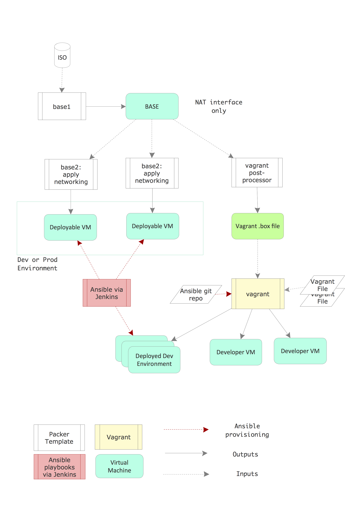

.. _enhancements:

Needed Enhancements
===================

.. epigraph::

   "*Perfection is finally attained not when there is no longer anything to
   add, but when there is no longer anything to take away.*"

   Antoine de Saint Exupéry, Terre des Hommes (1939)

..

There are several areas in the DIMS development architecture that are
more complex than is desirable, where things are difficult to use and
bugs often get in the way.  As the quote above attests, it is a challenge
to make things simple, elegant, and robust. Given limited resources,
time deadlines, and pressures to get things working, some components
of the DIMS project have attained the success of a prototype and
are now in need of reimplementation as a cleaner, tighter, next
major version.  This section describes some of those components
and thoughts on what to do next.

.. _packerVagrantWorkflow:

Packer and Vagrant Workflow Process
-----------------------------------

When the DIMS project began, and the team first began to work with
multiple Linux distributions (to follow guidance of each open source
tool producer's specified supported platform requirements), the
decision was made to use Packer for creating virtual machine
images from distribution disk image files (colloquially known as
**ISOs**, short for ISO 9660 format read-only boot images.).

To facilitate applying generic configuration settings and package
choices to multiple Linux distribution boot images, some helper
``Makefile`` rules files were created, allowing the dependency chain
to be defined such that Unix ``make`` can then optimize the
production of products. You don't want to have to perform every
step in a lengthy process (that involves downloading over a
Gigabyte of package files) every time you want to create a new
Vagrant virtual machine.

This process pipeline eventually included a Jenkins server
that would trigger ``ansible-playbook`` execution to implement
a complete continuous integration/continuous deployment
environment. This process looked like that depicted in Figure
:ref:`packer_diagram`.

.. _packer_diagram:

   Packer/Vagrant Workflow

..

The options at the time were to use something like Chef, Puppet, Heat, or
Terraform. The choice had been made to use Ansible for system configuration
automation, which the team did not see as being compatible with Chef and
Puppet, and programs like Heat and Terraform were designed for much more larger
and more complicated multi-region cloud service deployments. We wanted DIMS
deployments to fit in a single server rack using a small external network
footprint, since the PRISEM project on which DIMS was to be built was built
that way.

In September of 2015, well into the DIMS project, Hashicorp came out with
"otto" and "nomad". [#otto1]_ These looked promising, but were immature and looked costly
to implement. In August 2016, Hashicorp announced they were decommissioning and
abandoning "otto". [#otto2]_ There is still a need for a tool like this, but we
continued to use the tools we had developed despite their limitations.
Continued simplification of these tools and integration with Ansible
through use of the inventory and templating scripts, Packer ``.json``
files, and ``Vagrantfile`` configuration files would help smooth
things out.

In the long term, a solution that falls within the gap between a single server
rack with custom ``Makefile`` and scripts and something as complex as OpenStack
or AWS CloudFormation is desired.  This could be Packer and Terraform with
custom provisioners. Experiments using Packer to create Amazon instances was
successfully performed and a prototype of Terraform to provision Digital Ocean
droplets has been initiated and is anticipated to be completed after the
project is completed for use in subsequent follow on projects using the DIMS
software products.)

.. _kisckstart:

Normalization of Kickstart
--------------------------

Along with a standardized and simplified virtual machine instance build
process, a related simplified bare-metal boot capability is needed for more
efficient deployment of servers.  Debian has a mechanism known as Kickstart
that allows pre-configuration of steps needed to perform an unattended
("hands-off") installation of the operating system at boot time. This mechanism
is used in DIMS as part of the Packer workflow, and as part of the customized
USB thumb drive installer. It can also be made to work by Virtualbox (or other
hypervisors, for that matter) directly.

+ The Packer workflow uses inline commands to perform some initial
  system setup steps necessary to then use Ansible for the remainder
  of the system configuration.

+ The Vagrant workflow for Ubuntu and Debian uses some inline
  commands in the ``Vagrantfile`` for pre-Ansible customization,
  and some external scripts.

+ The Virtualbox Box file preparation for CoreOS uses external
  external scripts to prepare CoreOS for Ansible, and other
  ``Vagrantfile`` inline commands for boot-time customization.

+ The automated USB installer workflow uses the Kickstart ``pressed.cfg``
  file for what preparatory steps Kickstart is capable of performing,
  and a secondary pre-boot customization script that is downloaded and
  executed at install time for other pre-Ansible customization.

+ Manual creation of virtual machine guests or baremetal systems using
  the default Ubuntu or Debian installer (without using Kickstart)
  requires manual steps be performed to prepare the system for
  Ansible control.

The problem is, each of these workflows was created by separate team members at
different times, much of this without coordination or integration. Multiple
attempts were made to task team members with identifying all of the above and
reducing or refactoring the steps into a coherent and consistent set of
commonly-used scripts resulted. This resulted in some degree of simplification
and integration, but there is much work remaining to be done here.

Rather than having multiple incompatible inline shell mechanisms (which are the
easiest to implement, but least compatible means of accomplishing the same
tasks), a cleaner way to handle this situation is to reduce the steps required
in ``preseed`` steps to the bare minimum necessary to enable external Ansible
control.  Then these simpler ``pressed`` steps can be included as necessary by
each tool during Kickstart or the install-time tasks can be performed in Bash
shell scripts that can be called by each tool. This makes all of the
install-time steps consistent, configurable using Ansible, and shared across
tools. The remaining steps can then be turned into Ansible playbooks that can
be applied post-boot, again in a completely consistent manner.

.. _configurationManagementDatabase:

Configuration Management Database
---------------------------------

At the start of the project, a combination of variables stored in files that
could be exported through the shell's environment into scripts, ``Makefile`` rules,
and Ansible vars files, was used. These mechanisms were not fully integrated and it
was difficult to switch between different sets of variables to support multiple
simultaneous deployments.  For this reason, the team clung to a single deployment
for far too long.

In terms of Ansible, the use of the simplistic and limited INI style inventory, with
group and host variable files, was easy to learn, but proved difficult to
manage for multiple deployments and for this reason its use held the project
back for a long time.

Having multiple deployments was always a project objective, but how to achieve
it using free and open source tools was not obvious to the team.  It was clear
that a configuration management database was needed that supported a more
object-oriented "inheritance" style mechanism of defining variables that would
more easily accommodate managing multiple simultaneous deployments.

The need here is for a system that behaves something like the way OpenStack
supports a CLI for getting and setting variables in concert with a "cloud"
configuration file to control high-level storage locations that allow a single
interface to operate across multiple configuration databases. Ideally, this
database would serve as what is called a "single point of truth" or "single
source of truth" about not only hardware in a data center (e.g., servers and
network equipment, rack slot allocations, switch ports, VLANs), but also
configuration specifics that would drive Ansible playbooks for configuration
and templating of scripts that run on the systems.  A lot of research was done,
but nothing seemed to be a good fit.  Commercial tools like Ansible Tower [#awx]_
may
solve this problem, but that was neither in the project's budget, nor did that
conform with the objective of using only free and open source software tools.
Other solutions were similarly focused on enterprise-level deployments and were
not suitable for our use.

The tools that seem to exist are all focused on large-scale cloud deployments
for massively-scaled, multi-datacenter deployments using a federated model.
Trying to add them to the mix would be too costly and divert too much attention
from other critical elements of system integration.  What is needed by projects
like this is a mechanism for many small-scale, single-datacenter deployments
that are configured locally, but pull much of their code from the public
repositories on GitHub.

The solution that was settled upon in the DIMS project was a combination of
most variables being defaulted in roles with a separate "private" directory tree
for each deployment that holds customization details in the form of Ansible
YAML style
inventory files and local customized files and templates that playbooks in the
public ``ansible-dims-playbooks`` repository use before looking for generic
equivalents in the public repository. This allowed the ability to operate
multiple deployments in parallel with the public repository with less hassle,
though this is still not the ideal solution.

Continued Reimplementation and Integration of Services
------------------------------------------------------

Due to some of the issues listed in Section :ref:`challenges`, several of the
sub-systems in the original development deployment that were never fully under
Ansible control and had been hand-configured became unstable and failed. The
DIMS dashboard web application, the Tupelo server, the Jenkins server, were all
built on older Ubuntu 12.04 LTS and a Linux appliance virtual machine that was
one of the first servers installed. As these base operating systems were
manually created and managed, and the person who had originally set them up was
no longer working on the project, rebuilding them would prove difficult and
took lower priority to completion of other tasks. Some of the service, such as
the dashboard web app, where also constructed using older Ansible playbooks
that did not conform with the newer standards used for later playbooks and
would similarly take extra time to be fully brought up to current standards.
These tasks were added to Jira tickets, along with rebuilding all of the other
central components (e.g., the Jenkins build server that failed when
accidentally upgraded to a version with non-backward compatible features).

In the final months of the project, effort was put into re-implementing as many
of the original (version 1) deployment services as possible. The RabbitMQ service,
Jenkins with Git+SSH and Nginx file service, and Trident portal were all
reimplemented and replicated on a new server. The Tupelo, PRISEM RPC services,
and Lemon LDAP (for single-signon service) server roles remain to be
re-implemented and updated from their original Ansible roles and the
hand-crafted Jira system implementations.  The DIMS Dashboard, Redis server,
and ELK stack Ansible roles (which were all working in prototype form in year
2, prior to moving the project to UW Tacoma) should be easy to port after that,
but it is likely that the Javascript Dashboard and Java Tupelo code are now
out of date and will require experienced Javascript and Java programmers to
bring them up to current coding standards.

Secrets as a Service
--------------------

In the first year of the project, many secrets (passwords, non-public sensitive
sample data, private keys, and SSL/TLS certificates) were committed to source
code at worst, or passed around manually. This is neither a secure way to deal
with these secrets, nor does it scale well. Ansible Vault and use of a separated
private directory were prototyped as mechanisms to deal with the storing of
shared secrets, but passwords were not entirely eliminated in favor of a
ubiquitous single-signon mechanism. (Single-signon was implemented for Jira,
Jenkins, and the DIMS Dashboard server, but no farther.) Trident uses a
Javascript Web Token (JWT, pronounced "jot"). LDAP and JWT tokens could be
extended, a service like `FreeIPA`_ or HashiCorp Vault (both used in the system
illustration in Figure :ref:`bootmygovcloud`), or Docker's built-in secrets
management feature (see `Introducing Docker Secret Management`_ and
`Manage sensitive data with Docker secrets`_) could be used. There are
many tradeoffs and service integration issues in this area that make
this a non-trivial problem for all open source projects of this scope.

.. _testingenhancements:

Testing and Test Automation
---------------------------

Section :ref:`testingchallenges` describes effort put in by the PI to automate
system-wide testing. This primarily centered on post-processing output of BATS
tests and JSON files created using a simple user interface that collected
information related to the tests as described in the
:ref:`dimsswplan:dimsswplan`.  Another team member created scripts in Jira that
produced these same JSON files describing the output of manual tests managed
using Jira, reducing the amount of effort to perform and report on user
interface tests.  The final product was a structured set of RST files that
could be processed with Sphinx to produce the test report in HTML, PDF, and
epub formats.  Such test automation decreased effort required to perform test
cycles and supported automated production of reports with very little need for
manual input.

The larger vision here was to scale test production and reporting by
orchestrating the process using Ansible. For example, an Ansible playbook could
invoke the ``test.runner`` script (see :ref:`ansibledimsplaybooks:runningTests`)
on every system, placing output into a known file, which can then be retrieved
using the ``fetch`` module into a hierarchical directory structure based on the
system names. The contents of this directory tree can then be turned into
separate RST files and an ``index.rst`` file generated that is then rendered
using Sphinx.

Further automation of the testing process along these lines would decrease the
cost and disruption to regular development efforts, allowing more frequent
testing and decreasing the effort spent on resolving failed tests.  (This task
was on the to-do list, but had to take a lower priority to other more important
tasks.)

.. [#otto1] https://www.hashicorp.com/blog/otto/
.. [#otto2] https://www.hashicorp.com/blog/decommissioning-otto/
.. [#awx] A couple months before the DIMS project end of period of performance,
  RedHat released the Ansible Tower product in open source form as the
  `AWX Project`_. There was no time to fully learn how to use and evaluate
  this product, though it appears it would be relatively easy to add it to
  the ``ansible-dims-playbooks`` as a role and deploy it along with other
  system components.

.. _AWX Project: https://github.com/ansible/awx
.. _FreeIPA: https://www.freeipa.org/page/Main_Page
.. _Introducing Docker Secret Management: https://blog.docker.com/2017/02/docker-secrets-management/
.. _Manage sensitive data with Docker secrets: https://docs.docker.com/engine/swarm/secrets/
