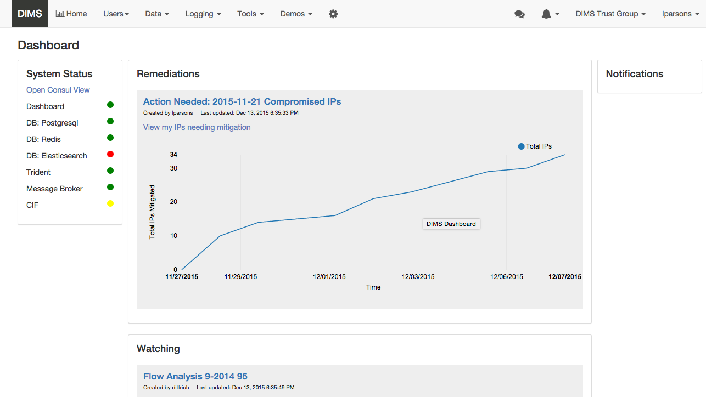

.. _successes:

Successes
=========

.. _continuousintegration:

Continuous Integration/Continuous Deployment
--------------------------------------------

Very early on, the project team established a set of Git source repositories
that were focused on discrete component services or functionality. Splitting
things up into discrete and focused repositories was done to establish a model
of modularity (to help make it easier to add new open source tools over time)
and to allow independent open source release of repositories.  In all, over 40
discrete repositories were created (some now deprecated, but the majority
providing functioning components addressing all of the requirements listed in
the contract and detailed in the :ref:`dimssr:dimssystemrequirements` document.

Next, a `Jenkins CI`_ server was set up and tied to the Git repositories using
Git post-commit hooks that trigger *build* jobs for source code and
documentation. Some build jobs then, in turn, trigger *deploy* jobs that push
the built products onto the systems that use them (see
:ref:`dimsdevguide:continuousintegration` for more detail on this process).

Throughout this entire workflow, log entries are generated (using a program
``logmon``) that publishes them on an AMQP channel where they can be monitored
from the DIMS Dashboard, monitored from a terminal session using the same
``logmon`` program, or collected from the logging channel for indexed storage.

.. _Jenkins CI: http://jenkins-ci.org/

.. _installBuildAutomation:

Install and Build Automation
----------------------------

System administrators are familiar with the steps of setting up a computer
systems, be it a server or a desktop development workstation, by starting with
an operating system installation ISO image, creating a bootable CD-ROM or USB
drive, creating accounts for the system administrator and some users, selecting
additional packages to install, and finally installing third-party open source
tools as needed.

This is a relatively simple process, and works well if the number of servers
and workstations is small, if the number of project members is small (and
turnover in staff is low and the team does not grow), if the software being
developed is limited in size and scope, and if things don't change very
quickly. Developers can even set up their own workstations and manage them.

.. _testintegration:

Integrated Tests
----------------

One of the requirements of the project was testing and validation
of the system components. A great deal of effort was spent in writing
comprehensive test plans and in performing two system-wide tests.
After the experience of doing these test plans and tests, a decision
was made to integrate the simplest set of tests as possible into
the normal operation of the system. The `Bats: Bash Automated Testing System`_
was chosen for its simplicity. A structured mechanism for embedding
tests into Ansible Playbook roles was developed, along with a script
to facilitate running tests named (not surprisingly) ``test.runner``.
This testing methodology is described in Section
:ref:`ansible_dims_playbooks:tests` of
:ref:`ansible_dims_playbooks:ansible_dims_playbooks`.

.. code-block:: none
   :caption: Successful test run from command line

    $ test.runner --level system --match pycharm
    [+] Running test system/pycharm
     ✓ [S][EV] Pycharm is not an installed apt package.
     ✓ [S][EV] Pycharm Community edition is installed in /opt
     ✓ [S][EV] "pycharm" is /opt/dims/bin/pycharm
     ✓ [S][EV] /opt/dims/bin/pycharm is a symbolic link to installed pycharm
     ✓ [S][EV] Pycharm Community installed version number is 2016.2.3

    5 tests, 0 failures

..

.. code-block:: none
   :caption: Failed unit test in Ansible playbook

    $ run.playbook --tags python-virtualenv
    . . .
    TASK [python-virtualenv : Run unit test for Python virtualenv] ****************
    Tuesday 01 August 2017  19:02:16 -0700 (0:02:06.294)       0:03:19.605 ********
    fatal: [dimsdemo1.devops.develop]: FAILED! => {
        "changed": true,
        "cmd": [
            "/opt/dims/bin/test.runner",
            "--tap",
            "--level",
            "unit",
            "--match",
            "python-virtualenv"
        ],
        "delta": "0:00:00.562965",
        "end": "2017-08-01 19:02:18.579603",
        "failed": true,
        "rc": 1,
        "start": "2017-08-01 19:02:18.016638"
    }

    STDOUT:

    # [+] Running test unit/python-virtualenv
    1..17
    ok 1 [S][EV] Directory /opt/dims/envs/dimsenv exists
    ok 2 [U][EV] Directory /opt/dims/envs/dimsenv is not empty
    ok 3 [U][EV] Directories /opt/dims/envs/dimsenv/{bin,lib,share} exist
    ok 4 [U][EV] Program /opt/dims/envs/dimsenv/bin/python exists
    ok 5 [U][EV] Program /opt/dims/envs/dimsenv/bin/pip exists
    ok 6 [U][EV] Program /opt/dims/envs/dimsenv/bin/easy_install exists
    ok 7 [U][EV] Program /opt/dims/envs/dimsenv/bin/wheel exists
    ok 8 [U][EV] Program /opt/dims/envs/dimsenv/bin/python-config exists
    ok 9 [U][EV] Program /opt/dims/bin/virtualenvwrapper.sh exists
    ok 10 [U][EV] Program /opt/dims/envs/dimsenv/bin/activate exists
    ok 11 [U][EV] Program /opt/dims/envs/dimsenv/bin/logmon exists
    not ok 12 [U][EV] Program /opt/dims/envs/dimsenv/bin/blueprint exists
    # (in test file unit/python-virtualenv.bats, line 54)
    #   `[[ -x /opt/dims/envs/dimsenv/bin/blueprint ]]' failed
    not ok 13 [U][EV] Program /opt/dims/envs/dimsenv/bin/dimscli exists
    # (in test file unit/python-virtualenv.bats, line 58)
    #   `[[ -x /opt/dims/envs/dimsenv/bin/dimscli ]]' failed
    not ok 14 [U][EV] Program /opt/dims/envs/dimsenv/bin/sphinx-autobuild exists
    # (in test file unit/python-virtualenv.bats, line 62)
    #   `[[ -x /opt/dims/envs/dimsenv/bin/sphinx-autobuild ]]' failed
    not ok 15 [U][EV] Program /opt/dims/envs/dimsenv/bin/ansible exists
    # (in test file unit/python-virtualenv.bats, line 66)
    #   `[[ -x /opt/dims/envs/dimsenv/bin/ansible ]]' failed
    not ok 16 [U][EV] /opt/dims/envs/dimsenv/bin/dimscli version is 0.26.0
    # (from function `assert' in file unit/helpers.bash, line 13,
    #  in test file unit/python-virtualenv.bats, line 71)
    #   `assert "dimscli 0.26.0" bash -c "/opt/dims/envs/dimsenv/bin/dimscli --version 2>&1"' failed with status 127
    not ok 17 [U][EV] /opt/dims/envs/dimsenv/bin/ansible version is 2.3.1.0
    # (from function `assert' in file unit/helpers.bash, line 18,
    #  in test file unit/python-virtualenv.bats, line 76)
    #   `assert "ansible 2.3.1.0" bash -c "/opt/dims/envs/dimsenv/bin/ansible --version 2>&1 | head -n1"' failed
    # expected: "ansible 2.3.1.0"
    # actual:   "bash: /opt/dims/envs/dimsenv/bin/ansible: No such file or directory"
    #

    PLAY RECAP ********************************************************************
    dimsdemo1.devops.develop   : ok=49   changed=7    unreachable=0    failed=1
    . . .

..

.. _dashboard:

DIMS Dashboard
--------------

A functional dashboard web application was developed using distributed system
features provided by several VM compute servers over AMQP, with single-signon
tied to Google authentication. This dashboard supported user stories defined in
the :ref:`dimssr:dimssr` with built-in test capabilities. This was the most
production-ready and well-engineered components of the system.

.. _dashboard_1:

   DIMS Dashboard

..

Unfortunately, the dashboard server was one of the systems that was
only partially under Ansible control, using the older style Ansible playbooks
that have not been fully brought up to current standards. This has been
on the to-do list, along with rebuilding all of the other central
components (e.g., the Jenkins build server that failed when accidentally
upgraded to a version with non-backward compatible features).

.. _stixingest:

Ingest of STIX Documents
------------------------

.. TODO(dittrich): complete this section
.. todo::

   Complete this section.

..

.. _Bats\: Bash Automated Testing System: https://github.com/sstephenson/bats#bats-bash-automated-testing-system
